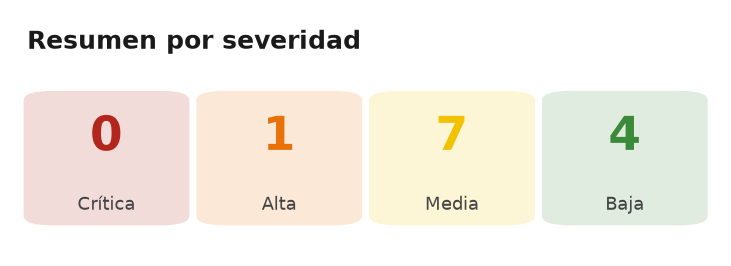
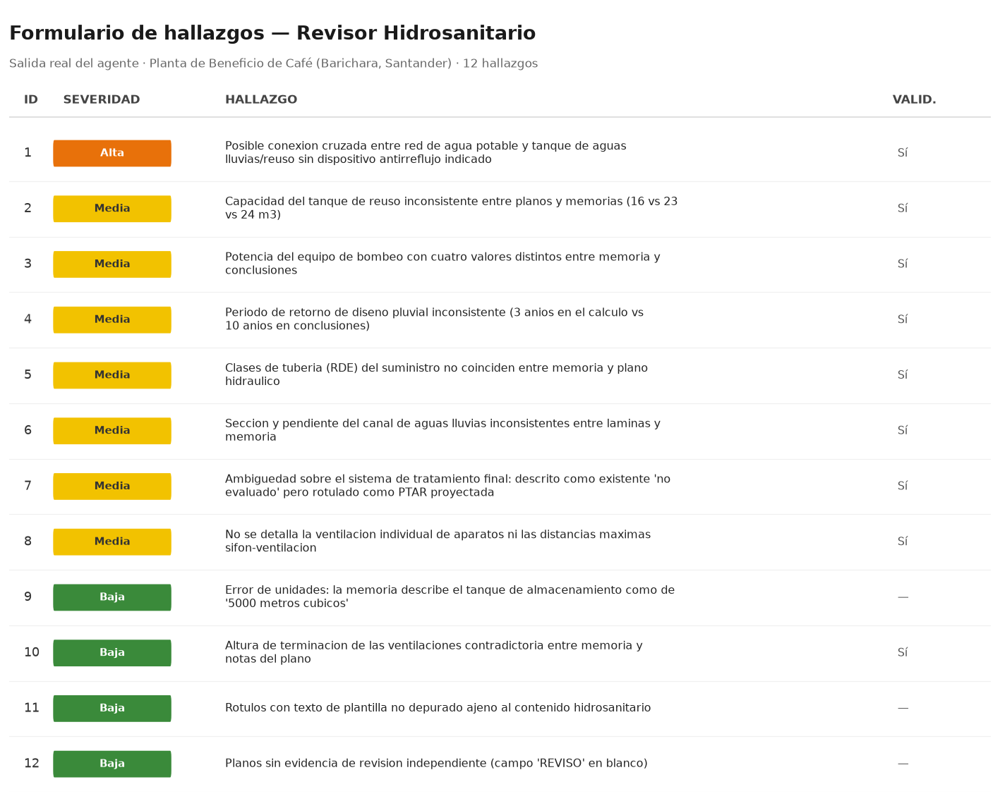

# Revisores de Planos — Marketplace de plugins para Claude Code

Marketplace de [Claude Code](https://docs.claude.com/en/docs/claude-code) con **agentes
revisores técnicos de planos de ingeniería**. Cada agente lee planos, identifica hallazgos
según reglas y normativa colombiana, y los registra en un formulario Excel (un hallazgo por
fila).

Hoy incluye dos plugins:

| Plugin | Comando | Disciplina |
|---|---|---|
| `revisor-planos` | `/revisar-hidrosanitario` | Diseños hidrosanitarios |
| `revisor-estructural` | `/revisar-estructural` | Diseños estructurales (NSR-10) |

Ambos comparten el **mismo esquema de hallazgos** a propósito: las dos tablas se pueden
consolidar en una sola para la revisión de coordinación inter-disciplinaria, sin transformar
nada.

## Capturas

Salida real del revisor hidrosanitario sobre un proyecto de prueba (Planta de Beneficio de
Café, Barichara – Santander): 12 hallazgos registrados en el formulario.





## Estructura del repositorio

```
.claude-plugin/marketplace.json     Catálogo del marketplace (los dos plugins)
plugins/revisor-planos/             Plugin hidrosanitario
plugins/revisor-estructural/        Plugin estructural (NSR-10)
```

Cada plugin tiene la misma anatomía:

| Componente | Descripción |
|---|---|
| `.claude-plugin/plugin.json` | Manifiesto del plugin. |
| `agents/<agente>.md` | Agente revisor senior de la disciplina (Colombia). |
| `commands/<comando>.md` | Comando que dispara el flujo de revisión. |
| `scripts/extraer_memorias.py` | Extrae texto de PDFs largos (memorias, estudios) con PyMuPDF. |
| `scripts/escribir_hallazgos.py` | Escribe los hallazgos en el Excel (append) con openpyxl; crea el archivo desde la plantilla si no existe. |
| `scripts/verificar_dependencias.py` | Avisa si faltan `pymupdf` u `openpyxl`. |
| `hooks/hooks.json` | Hook `SessionStart` que ejecuta la verificación de dependencias. |
| `templates/hallazgos_*.xlsx` | Plantilla del formulario de hallazgos de la disciplina. |

Además, `revisor-planos` trae `scripts/migrar_esquema.py` (migración del esquema v1 al v2) y
`revisor-estructural` trae `scripts/crear_plantilla.py` (regenera la plantilla desde cero).

## Requisitos

- Claude Code.
- Python 3.9+ con las dependencias:
  ```bash
  pip install pymupdf openpyxl
  ```

Al iniciar cada sesión, el plugin verifica que ambas estén instaladas y, si falta alguna,
imprime el comando exacto de instalación para tu intérprete de Python. **El plugin nunca
instala nada por su cuenta**: la instalación siempre la decides tú. Puedes ejecutar la
verificación a mano:

```bash
python plugins/revisor-estructural/scripts/verificar_dependencias.py
```

## Instalación

```
# 1. Agrega este repo como marketplace
/plugin marketplace add camilaco-12/revisor-planos

# 2. Instala el plugin que necesites (o ambos)
/plugin install revisor-planos@revisores-ingenieria
/plugin install revisor-estructural@revisores-ingenieria
```

O, para desarrollo local, agrega la carpeta como marketplace:

```
/plugin marketplace add /ruta/a/revisor-planos
```

## Uso

En ambos casos: ten a mano los planos (PDF/imagen). No necesitas crear el Excel — si la ruta
destino no existe, se genera automáticamente a partir de la plantilla incluida. El agente te
muestra un **resumen por severidad** y, tras tu confirmación, escribe los hallazgos.

### Revisor hidrosanitario

```
/revisar-hidrosanitario  Revisa los planos en ./04_DISENO_HIDROSANITARIO y escribe en ./hallazgos.xlsx
```

### Revisor estructural

```
/revisar-estructural  Revisa los planos en ./05_ESTRUCTURAL con la memoria ./memoria.pdf y escribe en ./hallazgos.xlsx
```

Recibe planos de cimentación, entrepisos, cubiertas y despieces de vigas, columnas y muros;
los cruza con la memoria de cálculo y el estudio geotécnico cuando existan. Si solo hay
planos, lo declara de entrada y marca como **no verificable** todo lo que dependa del
análisis, reportándolo como requerimiento de información en vez de callarlo.

También puedes simplemente pedirle a Claude que use el agente `revisor-hidrosanitario` o
`revisor-estructural`.

### Escritura manual de hallazgos

```bash
python plugins/<plugin>/scripts/escribir_hallazgos.py hallazgos.json ruta/al/formulario.xlsx
# opciones: --dry-run (no guarda)   --fecha AAAA-MM-DD
```

La ruta del Excel es obligatoria. Si el archivo **no existe**, el script copia la plantilla
a esa ruta (creando las carpetas necesarias) y escribe sobre la copia; si **ya existe**,
hace *append* continuando la numeración de IDs. El guardado es atómico: si falla a mitad de
camino, el archivo original queda intacto.

El JSON es una lista de objetos con las claves: `disciplina`, `hallazgo`, `ubicacion`,
`severidad`, `nivel_confianza`, `referencia_normativa`, `riesgo`, `justificacion_tecnica`,
`accion_correctiva`, `plano_referencia`.

Códigos de salida: `0` OK · `2` error de permisos · `3` error de entrada · `4` falta una
dependencia.

## Esquema del formulario de hallazgos

Idéntico en los dos plugins (esquema v2):

| Col | Campo | Quién lo llena |
|---|---|---|
| A | `ID` | Script (consecutivo) |
| B | `disciplina` | Agente |
| C | `hallazgo` | Agente |
| D | `ubicacion` | Agente |
| E | `severidad` | Agente (`Crítica`/`Alta`/`Media`/`Baja`) |
| F | `nivel_confianza` | Agente (`Alta`/`Media`/`Baja`) |
| G | `referencia_normativa` | Agente |
| H | `riesgo` | Agente |
| I | `justificacion_tecnica` | Agente |
| J | `accion_correctiva` | Agente |
| K | `plano_referencia` | Agente |
| L | `fecha_deteccion` | Script (fecha del día) |
| M | `estado` | Seguimiento manual (siempre nace en "Pendiente") |

El encabezado está en la **fila 4** y los datos empiezan en la **fila 5**. La **severidad**
mide qué tan grave es el hallazgo; el **nivel de confianza**, qué tan seguro está el agente
de que sea real. Son dos ejes distintos y ambos son obligatorios.

## Solución de problemas en Windows

Si la escritura al Excel falla, el script se detiene con código `2` y un mensaje que explica
la causa y los pasos a seguir — **no genera una salida alternativa ni escribe en otra ruta**.
El archivo destino queda intacto y ningún hallazgo se pierde a medias.

Las dos causas habituales:

1. **El Excel está abierto.** El script detecta el archivo de bloqueo `~$archivo.xlsx` que
   crea Excel y te lo dice directamente. Cierra el libro y reintenta.
2. **Acceso controlado a carpetas** (protección anti-ransomware de Windows Defender), típico
   si el Excel está en Escritorio, Documentos o Imágenes. Autoriza tu `python.exe` en
   *Seguridad de Windows → Protección contra virus y amenazas → Protección contra ransomware
   → Permitir una app a través del acceso controlado* (el mensaje de error incluye la ruta
   exacta de tu intérprete), o usa una ruta destino fuera de esas carpetas.

También puede fallar si la carpeta es de solo lectura o está en OneDrive sin sincronizar.

## Roadmap

- [x] Agente revisor hidrosanitario + escritura a Excel.
- [x] Estructura de marketplace multi-plugin.
- [x] Agente revisor estructural (NSR-10).
- [ ] Agentes para otras disciplinas (eléctrico, gas…).
- [ ] Revisión de coordinación inter-disciplinaria (interferencias entre disciplinas).

## Licencia

MIT — ver [LICENSE](LICENSE).
